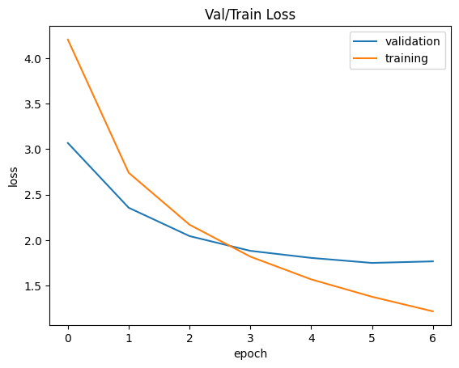
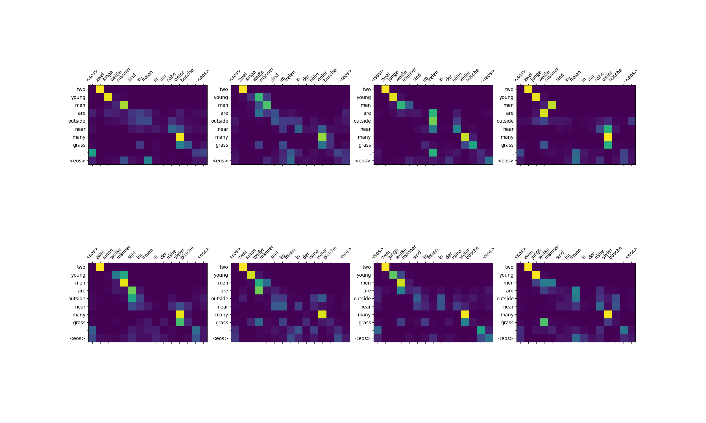

# Trans-late-former

An encoder-decoder translation transformer in PyTorch, with my own implementation of multi-head attention. The model was primarily based on the architecture described in "Attention is all you Need" (Vaswani, 2017), with some small differences - I found learned positional embeddings worked slightly better than sinusoidal positional embeddings and I added gradient norm clipping as various other implementers achieved better performance with them. To train the model, install `requirements.txt` and run `python3 main.py`. The model's building blocks are contained in `model.py`.

### Dataset
The model was trained on the Multi30k dataset to translate from German to English. This was a good sized datset for a "GPU poor" like myself because an RTX 3060 can train a full epoch in a few minutes.  

### Results 

I achieved a BLEU score of 33.9 on the validation set and validation loss of 1.75. This is slightly less than SOTA on this dataset with a similar architecture. 

### Analysing attention

It was interesting to explore the QK^T attention matrices produced by the model to build some intuitions about how transformers operate. For example, take the attention matrix of the final decoder layer when the model is attempting to translate the German sentence "zwei junge weiße männer sind im freien in der nähe vieler büsche". My model translates this as "2 young men are outside near many grass" which is close to but not quite the correct translation "2 young white men are outdoors near many bushes". While it is hard to directly interpret the attention matrix, we can see the classic diagonal pattern tokens influence output words in similar positions but deviating from this pattern when word order is treated differently in src and target languages. 

